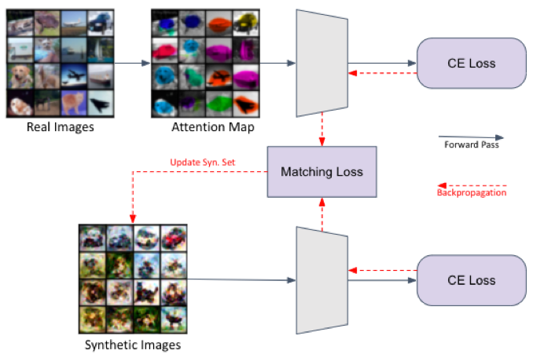

# Attention Masked Dataset Condensation
Dataset condensation is proposed in paper [Dataset Condensation with Gradient Matcing](https://openreview.net/pdf?id=mSAKhLYLSsl). It aims to condense a large traing set into a small synthetic set such tahat model trained on the small synthetic set would obtain comparable testing performance to that trained on large training set.

Our paper propose attention masking to input images so that model can learn only important visual parts of the image. Future work can further stretch out to background removal or unbiasing. Our paper is accepted to [IPIU2022](http://www.ipiu.or.kr).


### Method
<p align="center"></p>
<center>Figure 1: Proposed method masks important visual part of the input using attention map. After training classification model using CE loss only with masked images, we synthesize small training set which generates similar gradients to given masked images. </center><br>

### Setup
Install packages in the requirements. Attention mask can be downloaded [here.](https://drive.google.com/file/d/1iSPzb63JjindU8N1H0D3EtnHPGdRH5ey/view?usp=sharing)

### Proposed model - Table 1
```
python main.py  --dataset CIFAR10  --model AlexCifarNet  --ipc 10
# --ipc (images/class): 1, 10, 20, 30, 40, 50
```

### Proposed model + Differential Augmentation - Table 2
```
python main.py  --dataset CIFAR10  --model AlexCifarNet  --ipc 10 --method DSA  --init real --dsa_strategy color_crop_cutout_flip_scale_rotate
# --ipc (images/class): 1, 10, 20, 30, 40, 50
```

### Performance
|  | [DD](https://arxiv.org/abs/1811.10959) | [DC](https://openreview.net/pdf?id=mSAKhLYLSsl) | Ours |
 :-: | :-: | :-: | :-: | :-: | :-:
| 1 img/cls  | - | 24.2 | 24.5 |
| 10 img/cls | 36.8 | 39.1 | 40.1 |

Table 1: Testing accuracies (%) of AlexNet trained from scratch on 1 or 10 synthetic image(s)/class.